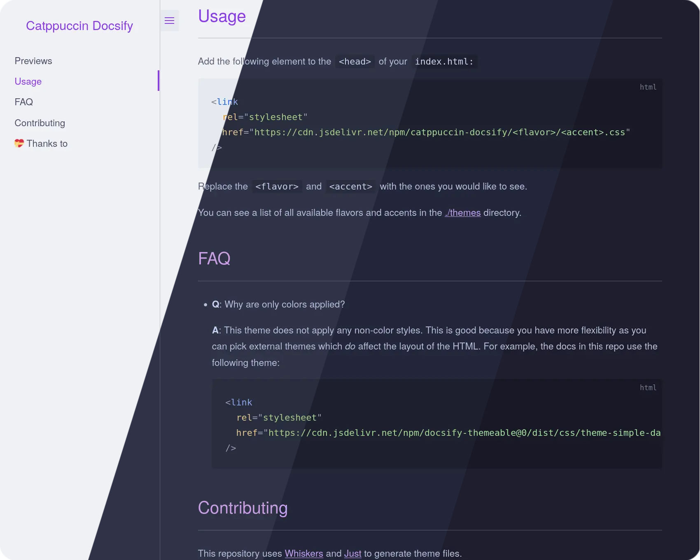
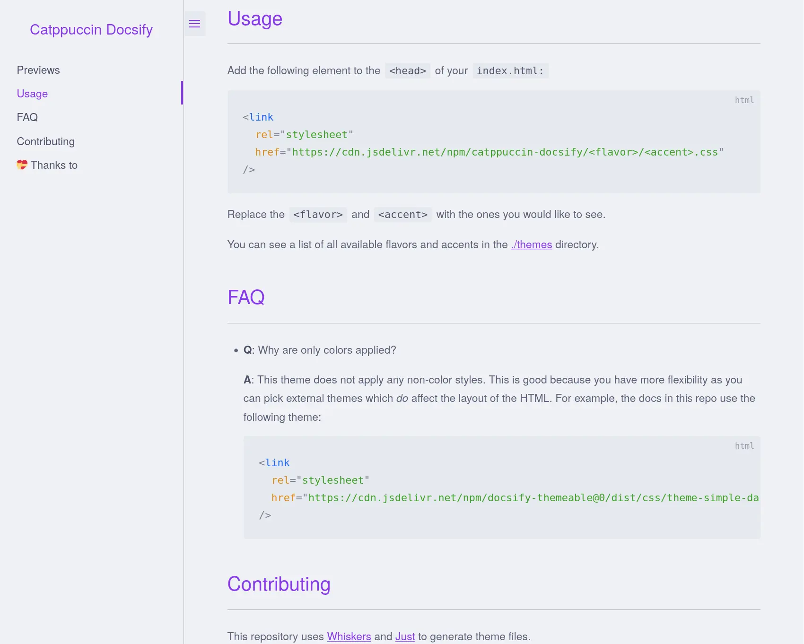
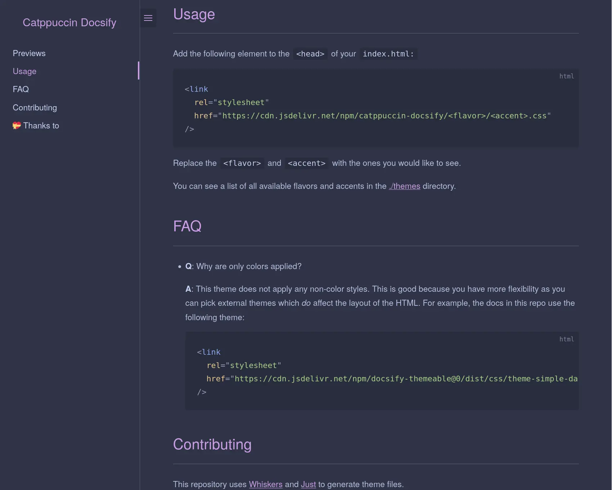
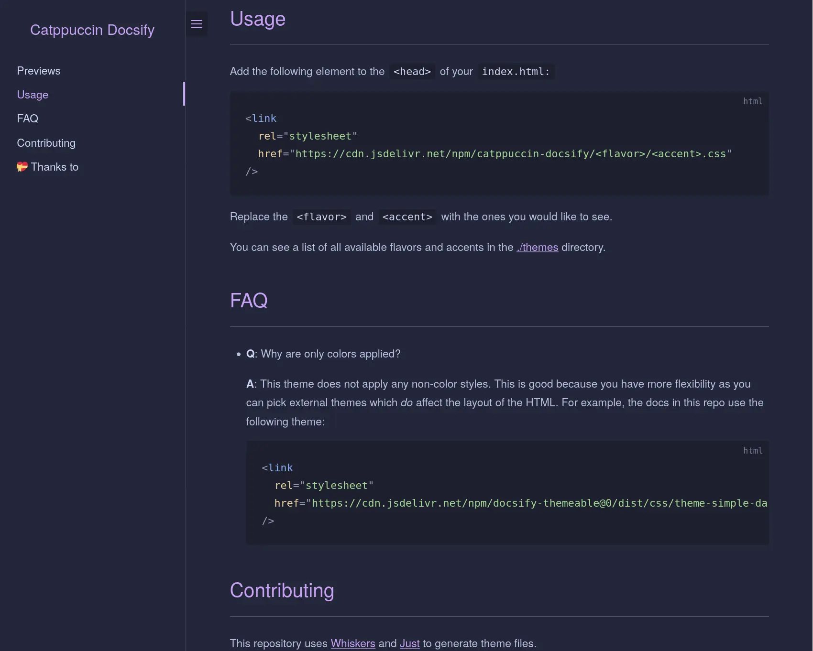
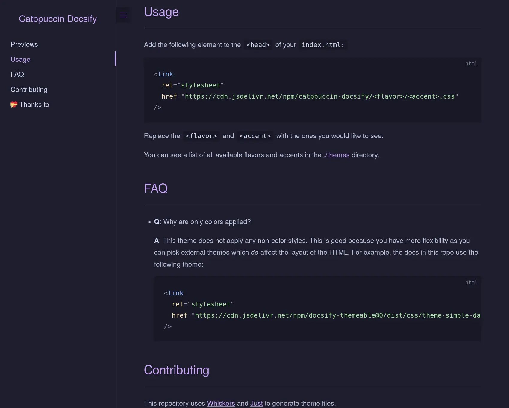

<h3 align="center">
	<br/>
	
	Catppuccin for <a href="https://github.com/docsifyjs/docsify">Docsify</a>
	
</h3>

<p align="center">
	<a href="https://github.com/catppuccin/docsify/stargazers"></a>
	<a href="https://github.com/catppuccin/docsify/issues"></a>
	<a href="https://github.com/catppuccin/docsify/contributors"></a>
</p>

<p align="center">
	
</p>

<div id="previews"></div>

## Previews

<details>
<summary>🌻 Latte</summary>

</details>
<details>
<summary>🪴 Frappé</summary>

</details>
<details>
<summary>🌺 Macchiato</summary>

</details>
<details>
<summary>🌿 Mocha</summary>

</details>

## Usage

Add the following element to the `<head>` of your `index.html:`

```html
<link
  rel="stylesheet"
  href="https://cdn.jsdelivr.net/npm/catppuccin-docsify/<flavor>/<accent>.css"
/>
```

Replace the `<flavor>` and `<accent>` with the ones you would like to see.

You can see a list of all available flavors and accents in the [./themes](./themes) directory.

## FAQ

- **Q**: Why are only colors applied?

  **A**: This theme does not apply any non-color styles. This is good because you have more flexibility as you can pick external themes which _do_ affect the layout of the HTML. For example, the docs in this repo use the following theme:

  ```html
  <link
    rel="stylesheet"
    href="https://cdn.jsdelivr.net/npm/docsify-themeable@0/dist/css/theme-simple-dark.css"
  />
  ```

## Contributing

This repository uses [Whiskers](https://github.com/catppuccin/whiskers) and [Just](https://github.com/casey/just) to generate theme files.

Edit the `docsify.tera` template, and run `just build`.

## 💝 Thanks to

- [Nikita Revenco](https://github.com/nik-rev)

&nbsp;

<p align="center">
	
</p>

<p align="center">
	Copyright &copy; 2021-present <a href="https://github.com/catppuccin" target="_blank">Catppuccin Org</a>
</p>

<p align="center">
	<a href="https://github.com/catppuccin/catppuccin/blob/main/LICENSE"></a>
</p>
